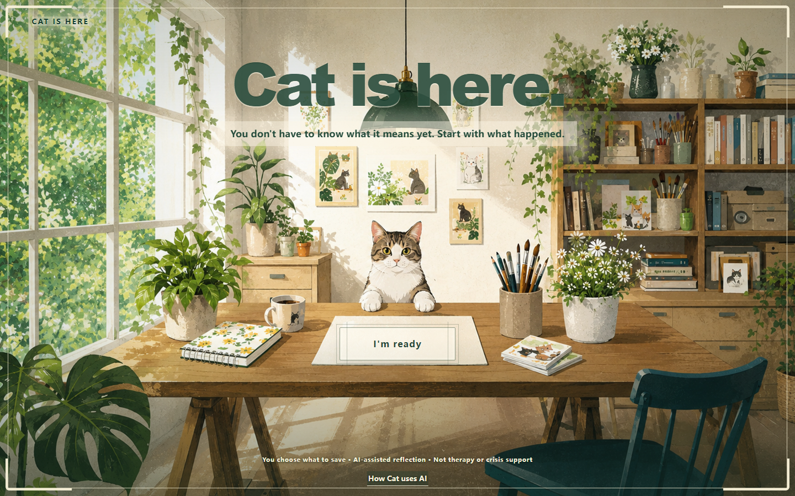

# Cat Is Here / 猫在

Cat Is Here is a guided reflection product for everyday distress. It helps a person separate one event from the meaning they gave it, notice what they did next, and test one editable guess through a small action. It does not diagnose or provide treatment.

Live competition URL: https://cat-is-here.onrender.com/?demo=competition&lang=en

Source code: https://github.com/jjiao4672-code/cat-is-here

## Competition demo

Start the local server, then open:

`http://127.0.0.1:8877/?demo=competition&lang=en`

The page starts empty. A judge can write an event or open the quiet example picker and choose Relationship or Job search. Example text is labeled, editable, and never preloads the later answers.

The current competition flow is:

1. Describe one event with an option, free text, or both.
2. If the entry is broad, name one concrete event.
3. Name the feeling before Cat explores interpretation, action, and result.
4. Answer one tailored question per screen. The interview stops when the needed fields are present and never exceeds eight rounds.
5. Write your own short summary and correct Cat's reflection.
6. Review an editable Problem Map: event, interpretation, feeling, action or inaction, immediate and later result, a tentative guess, and what remains unknown.
7. Propose one small action. Cat shows one suggestion only when asked.
8. Choose to act now, schedule it, or not do it. Afterward, record what happened and update the judgment in your own words before Cat summarizes.

Competition mode does not write to Local Storage or IndexedDB. Normal mode saves a structured record only after the user chooses “Leave it with Cat” or “留给小猫.” Full verbatim conversation is not stored as a long-term record.



## What AI does

AI chooses the next question from the current event and confirmed answers, then proposes a correctable map. Before the map, the interview asks in order about feeling, interpretation, supporting evidence, counterevidence, another possible explanation, action or avoidance, the immediate and later result, and a possible protective purpose. It does not decide the user's personality, read another person's motives, or determine whether a relationship, application, or prediction will turn out well.

The server validates each question and map before display. A question must target an allowed field, avoid repetition, keep user text as the source, and stay in the selected language. A map must use valid source IDs, preserve uncertainty, reject diagnostic claims, and keep the proposed action under the user's control.

When a generated follow-up fails validation, the service repairs it or uses a deterministic question for the next missing field. It does not silently manufacture a map. If map generation still fails, the page stops and asks whether to show a labeled synthetic example. The user can retry Live AI instead.

## Architecture


```text
Browser
  safety routing before ordinary reflection
  current event and confirmed answers in memory
  optional IndexedDB record after explicit consent
  competition mode with persistence disabled
        |
        v
Node service
  request-size limit and identifier redaction
  prompt-injection boundary
  structured generation and repair attempts
  question, source, uncertainty, language, and safety validation
        |
        v
Configured OpenAI-compatible chat-completions provider
```

Saved history is not automatically sent with a new event. Each competition request contains the current event and confirmed answers needed for that step.

## Run locally

Requires Node.js 18 or newer.

```powershell
Set-Location "E:\付费情报简报\adlerlens-mvp"
npm start
```

The local setup page, `/api-setup.html`, accepts a DeepSeek key for the current server process. The key is held in memory and is lost when the server stops.

For a hosted competition build, set these server-side environment variables:

```text
OPENAI_API_KEY=...
OPENAI_BASE_URL=https://api.deepseek.com
OPENAI_MODEL=deepseek-v4-pro
COMPETITION_HOSTED=1
```

Do not put a real key in browser code, source control, or a public setup form. Hosted mode blocks the page from replacing the server key.

## Tests

```powershell
npm test
```

Current result: 105 tests passing. The checks cover the required depth stages, question order, typed and selected answers, back navigation, duplicate-question prevention, unsupported self-worth claims, primary versus follow-up meaning fields, past actions versus future experiments, all required map fields, user-written summary, correction, action branches, user-owned cognitive update, explicit saving, safety routing, identifier redaction, bilingual output, failure handling, competition persistence isolation, visible-map experiment eligibility, responsive experiment-card layout, and hosted API request limits.

## Competition fit

Hack for Humanity requires functioning source code in a GitHub repository and a video no longer than four minutes. The event closes on September 4, 2026 at 11:45 p.m. EDT. Cat Is Here is intended for the Mental Health track and is also relevant to Responsible AI, Best Use of AI/ML, Best Design, and Best Innovation and Creativity.

- [Competition page](https://hack-for-humanity-summer-26.devpost.com/)
- [Official rules](https://hack-for-humanity-summer-26.devpost.com/rules)

## Limits

- No clinical validation or treatment-effect evidence.
- No account, cloud backup, or cross-device sync.
- One active observation topic at a time.
- Regex redaction cannot guarantee removal of every identifier.
- Provider terms, retention, regional law, crisis resources, and independent security review must be resolved before public use with sensitive personal data.
- The public deployment is live; a larger multi-run model-quality sample is still needed.

Development in this workspace began on August 10, 2026, after the competition opened on August 7. See [RESPONSIBLE_AI.md](./RESPONSIBLE_AI.md), [ATTRIBUTIONS.md](./ATTRIBUTIONS.md), and [DEVPOST_SUBMISSION.md](./DEVPOST_SUBMISSION.md).

The product name has not completed formal trademark or domain clearance.
